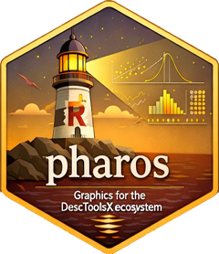

# lyra 

**Descriptive Statistics Graphics and Utilities**

Version 0.0.0.927 · License GPL (≥ 2)

<!-- badges: start -->
<!-- [](https://github.com/AndriSignorell/lyra/actions) -->
<!-- badges: end -->

## Overview

`lyra` is the graphics package of the **DescToolsX ecosystem**. It provides
a comprehensive collection of statistical plots, geometric drawing primitives,
color tools, annotation helpers, and formatting utilities — all built directly
on **base R graphics**.

Building on base graphics keeps the package lightweight and fully compatible
with everything base R offers (`layout()`, `par()`, custom devices), while a
central **theme system** and consistent argument conventions remove the usual
boilerplate: sensible defaults, automatic margin handling, and uniform
styling across all plot functions.

`lyra` is part of the DescToolsX package suite:

| Package   | Role                                    |
|-----------|-----------------------------------------|
| `bedrock` | core infrastructure and utilities       |
| `lyra`  | graphics and visualization (this package) |
| `lumen`   | statistical tests and confidence intervals |
| `alloy`   | model fitting and evaluation            |
| `hermes`  | reporting and output                    |

## Installation

``` r
# development version from GitHub
remotes::install_github("AndriSignorell/lyra")
```

## Key Features

### Statistical plots

A large family of high-level `plot*()` functions with a consistent
interface (formula support, grouped variants, theme-driven styling):

- **Distributions:** `plotDens()`, `plotDens2D()`, `plotDensBox()`,
  `plotViolin()`, `plotRidge()`, `plotBox()`, `plotECDF()`, `plotFdist()`,
  `plotQQ()`, `plotProbDist()`
- **Categorical data:** `plotBar()`, `plotDot()`, `plotMosaic()`,
  `plotCatDist()`, `plotTreemap()`, `plotWeb()`
- **Relationships:** `plotXY()`, `plotLines()`, `plotCor()`, `plotAssoc()`,
  `plotBubble()`, `plotHexbin()`, `plotBag()`
- **Special purpose:** `plotTimeSeries()`, `plotArea()`, `plotMiss()`,
  `plotPropCI()`, `plotCirc()`, `plotPolar()`, `plotTernary()`,
  `plotBinaryTree()`, `plotFun()`

Plot methods for objects from the suite are included, e.g.
`plot.Desc.*` (for `desc()` results), `plot.Lc` (Lorenz curves),
`plot.BlandAltman`, and `lines()` methods for `lm` and `loess` fits.

### Theme system

All plot functions draw their defaults from a central, replaceable theme:

``` r
getTheme()                              # inspect the active theme
setTheme(list(palette = "Set2"))        # change one component globally
setTheme(list(grid = list(col = "grey90", lwd = 1, lty = "dotted")))
resetTheme()                            # back to the default
```

Explicit arguments always override the theme at the call site; the theme in
turn overrides the package defaults. One place to define the look — every
plot follows.

### Geometric drawing

Geometry follows a clean two-step design: **constructors** create geometry
objects — `circle()`, `ellipse()`, `arc()`, `bezier()`, `band()`, `ring()`,
`regPolygon()` — and an overloaded `polygon()` generic (fully compatible with
`graphics::polygon()`) draws them. `canvas()` provides a blank, aspect-true
plotting canvas, `polarGrid()` a polar coordinate system.

``` r
canvas()
polygon(circle(radius = 1), col = "lightblue")
polygon(regPolygon(radius = 0.7, numVertices = 5), border = "red")
```

Because geometries are plain objects, they can be transformed before
drawing (`rotate()`, `transformXY()`) or combined into composite shapes.

### Colors

- **Manipulation:** `addAlpha()`, `fade()`, `darken()`, `lighten()`,
  `mixColors()`, `grayscale()`, `colToOpaque()`
- **Analysis:** `contrastColor()` (legible text colors on any background),
  `findColor()` (nearest named color)
- **Conversion:** hex, RGB, HSV, CMY(K), and long integer representations
  (`colToHex()`, `hexToRGB()`, `cmykToRgb()`, `rgbToLong()`, …)
- **Palettes:** `pal()` and `palNames()` for the suite's curated palettes

### Annotation and layout helpers

Utilities that handle the fiddly parts of base graphics:

- `stamp()` — automatic plot stamping (author/date), theme-controlled
- `boxedText()`, `barText()`, `textLegend()`, `colLegend()` — labels and
  legends beyond `text()`/`legend()`
- `errBars()`, `shade()`, `splineCI()`, `band()` — uncertainty display
- `axisBreak()`, `axTicks()`, `titleRect()`, `lineSep()` — axis and title
  furniture
- `spreadOut()` — de-overlapping label positions
- `isValidPlotRegion()` — check the device geometry before drawing

### Formatting and output

- `fm()` / `fmCI()` — flexible number and confidence interval formatting
- `notation()`, `style()` — notation and style control
- `as.html()`, `toHtmlTable()`, `preview()` — HTML rendering of tables and
  plots, e.g. for quick reports

### Coordinates, units, and strings

- Coordinate transformations: `transformXY()`, `rotate()`, `degToRad()`,
  `lineToUser()`, `abcCoords()`
- Unit conversion engine: `convUnit()` with SI and derived units
- A complete `str*()` family for string handling (`strTrim()`, `strPad()`,
  `strAlign()`, `strExtract()`, `strDist()`, `strAbbr()`, …)

## Example

``` r
library(lyra)

# grouped violin plot, styled by the active theme
plotViolin(mpg ~ cyl, data = mtcars)

# correlation matrix plot
plotCor(cor(mtcars))

# custom geometric graphic
canvas(main = "lyra primitives")
polygon(circle(radius = 1), col = addAlpha("steelblue", 0.4))
polygon(regPolygon(radius = 0.7, numVertices = 6), border = "red")
```

## Design principles

- **Base graphics, no grid** — lightweight, transparent, hackable
- **Consistent API** — lowerCamelCase, uniform argument names and ordering
  across the whole suite
- **Theme-driven** — one place to define the look, every plot follows
- **Robust by default** — automatic margin adjustment, device geometry
  checks, protected graphics state
- **Performance-aware** — Rcpp under the hood where it matters

## Documentation

- Website: <https://andrisignorell.github.io/lyra/>
- Bug reports: <https://github.com/AndriSignorell/lyra/issues>

## License

GPL (≥ 2)
