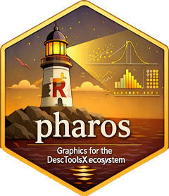

# 📦 pharos 

<!-- badges: start -->
[](https://CRAN.R-project.org/package=pharos)
[](https://www.gnu.org/licenses/old-licenses/gpl-2.0.html)
<!-- badges: end -->

**Title:** Descriptive Statistics Graphics and Utilities\
**License:** GPL (≥ 2)

## 🧩 Overview

`pharos` is the graphics layer of the **DescToolsX ecosystem**. It draws
statistical graphics on top of base graphics — distribution and density
displays, bivariate and categorical plots, diagnostic and model
evaluation panels — and supplies the colour, geometry, formatting and
HTML tools they are built from.

A theme system resolves colours, symbols and layout centrally, so the
look of a whole analysis can be set once instead of being repeated at
every call.

The package is self-contained and usable without the rest of the suite.

📖 **Documentation:** <https://andrisignorell.github.io/pharos/>

## ⚙️ Installation

``` r
install.packages("pharos")
```

Or the development version from GitHub:

``` r
remotes::install_github("AndriSignorell/pharos")
```

## 📚 Core Features

### 🔹 Univariate and Distribution Plots

-   `plotFreqDist()`, `plotDens()`, `plotECDF()`, `plotProbDist()`
-   `plotBox()`, `plotViolin()`, `plotRidge()`, `plotDensBox()`
-   `plotDot()`, `plotBar()`, `plotBag()`, `plotQQ()`

### 🔹 Bivariate and Multivariate Plots

-   `plotXY()`, `plotBubble()`, `plotDens2D()`, `plotHexbin()`
-   `plotCor()`, `plotAssoc()`, `plotMosaic()`, `plotHeatmap()`
-   `plotTernary()`, `plotPolar()`, `plotCirc()`, `plotWeb()`,
    `plotTreemap()`

### 🔹 Model and Diagnostic Displays

-   `plotLift()`, `plotPropCI()`, `plotMiss()`, `plotCatDist()`
-   `plot.BlandAltman()`, `plot.Lc()`, `plotBinaryTree()`
-   `lines.lm()`, `lines.loess()`, `splineCI()`

### 🔹 Layout and Faceting

-   `plotFacet()` — panel layouts with a user-supplied panel function
-   `canvas()`, `plotArea()`, `mar()`, `abcCoords()`, `axisBreak()`,
    `axTicks()`, `axisFmt()`
-   `spreadOut()`, `lineToUser()`, `isValidPlotRegion()`

### 🔹 Annotation

-   `boxedText()`, `barText()`, `textLegend()`, `colLegend()`,
    `errBars()`, `band()`, `stamp()`, `titleRect()`, `lineSep()`

### 🔹 Colour

-   Conversions: `colToHex()`, `colToRgb()`, `colToHsv()`,
    `hexToRgb()`, `rgbToCmy()`, `cmykToRgb()`, `longToRgb()`
-   Manipulation: `addOpacity()`, `fade()`, `darken()`, `lighten()`,
    `shade()`, `mixCol()`, `contrastCol()`, `grayScale()`
-   Palettes: `pal()`, `palNames()`, `hcol()`, `findCol()`,
    `setBackCol()`

### 🔹 Geometry

-   `arc()`, `bezier()`, `circle()`, `ellipse()`, `ring()`,
    `polygonX()`, `regPolygon()`, `polarGrid()`
-   `rotate()`, `transformXY()`, coordinate conversions, degree/radian
    conversion, `convUnit()`

### 🔹 Formatting and Strings

-   `fm()`, `fmCI()`, `unit()`, `ftable.list()`
-   `strAbbr()`, `strAlign()`, `strCap()`, `strChop()`, `strPad()`,
    `strTrunc()`, `strRev()`, `strDist()`, `strSpell()`, `strExtract()`

### 🔹 HTML Output

-   `asHtml()`, `toHtmlTable()`, `escapeHtml()`, `htmlNotation()`,
    `htmlSubscript()`, `asImg()`, `asFileLink()`, `embedFile()`,
    `preview()`

## 🚀 Design Principles

-   **Consistent** — lowerCamelCase API and uniform argument
    conventions across the whole DescToolsX suite
-   **Themed** — colours, symbols and layout resolved centrally through
    `theme()` and `style()`
-   **Base graphics** — no grid, no extra graphics stack; plots compose
    with everything already in R
-   **Fast** — performance-critical routines implemented in Rcpp

## 🧪 Example

``` r
library(pharos)

# distribution overview: histogram, density, boxplot, ecdf in one panel
plotFreqDist(rnorm(500))

# named plot positions without arithmetic
plot(rnorm(20), type = "n")
xy <- abcCoords("topleft", inset = 1)
text(xy$xy$x, xy$xy$y, "annotation", adj = xy$adj)

# colour manipulation
fade(pal("dark"), 0.4)

# faceting with a panel function
plotFacet(split(iris$Sepal.Length, iris$Species),
          dim = c(1, 3), FUN = plotDens)
```

## 🧱 The Suite

`pharos` builds on `bedrock` (base utilities). `DescToolsX` (descriptive
statistics), `lumen` (tests and intervals), `alloy` (modelling), `pons`
(MS-Office) and `swissValet` (RStudio addins) complete the family.

## 🙏 Acknowledgements

Parts of the code and documentation were reviewed with the help of large
language models (OpenAI Codex, Anthropic Claude). Every suggestion was
assessed, edited and verified by the maintainer, who remains solely
responsible for the content of this package.

## 📜 License

GPL (≥ 2)
